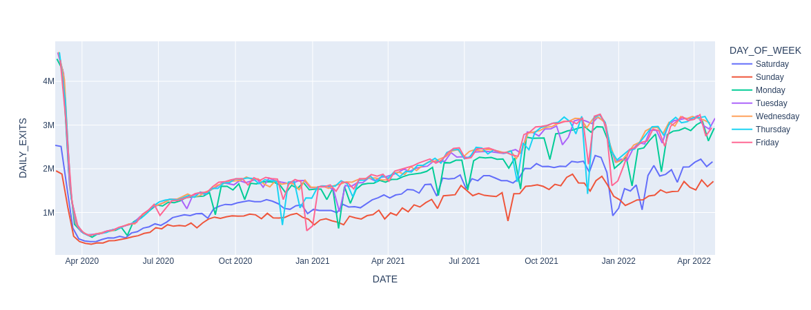
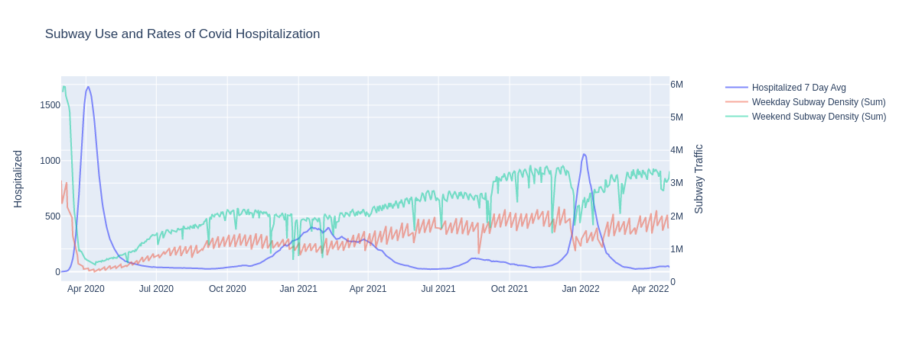

# Subway Use and Covid Rates
## Background
### **Case**
- The NYC Health Department wishes to validate the effectiviness of Covid related guidance in regards to Subway usage. 

### **Methodolgy**
- Data used included [MTA Turnstile Data](http://web.mta.info/developers/turnstile.html) and [Daily Covid 19 Data for NYC](https://data.cityofnewyork.us/Health/COVID-19-Daily-Counts-of-Cases-Hospitalizations-an/rc75-m7u3). SqlAlchemy and Pandas were used for importing the datasets.
- Subway entries, exits, and line density**[*](## "= (Station Entries + Station Exits) / # of Lines")** were calculated for station and day between January 2020 and April 2022. Subway data was then merged with Covid data.
- Correlations were calculated for subway and covid metrics. Visualizations comparing subway usage and covid rates were developed using Matplotlib and Plotly.
 
 
***
## Results

### **Conclusions**
- Subway use drastically declined as the pandemic startd and NYC went into lockdown. Generally, subway use has consitently been rising since May 2020.
  
- Subway use was indeed negatively related to Covid Rates. As Covid spiked people used the subway less.
  
- There is a strong seasonality componenent wihtin subway use between Weekdays and Weekends. Weekend subway use is more strongly related with Covid Rates than Weekdays. 
### **Tables**
  
 Correlations Between Subway Use and Covid 19 Rates 

|  | Cases | Hosp**[*](## "Hospitalizations")** |   Deaths |   Weekly Cases |   All**[*](## "Including unconfirmed cases")** Weekly Cases |   Weekly  Hosp**[*](## "Hospitalizations")** | Weekly Deaths |  All**[*](## "Including unconfirmed cases")** Weekly Deaths |
|:--------------|-------------:|---------------------:|--------------:|----------------------:|--------------------------:|----------------------:|-----------------------:|---------------------------:|
| Entries |        0.019 |               -0.287 |        -0.392 |                -0.055 |                    -0.049 |                -0.332 |                 -0.399 |                     -0.388 |
| Exits   |        0.052 |               -0.305 |        -0.414 |                -0.013 |                    -0.006 |                -0.342 |                 -0.418 |                     -0.409 |
| Density  |        0.035 |               -0.299 |        -0.408 |                -0.037 |                    -0.03  |                -0.341 |                 -0.414 |                     -0.404 |

    
Full Correlation Table

|   |   | Cases | Hosp**[*](## "Hospitalizations")** |   Deaths |   Weekly Cases |   All**[*](## "Including unconfirmed cases")** Weekly Cases |   Weekly  Hosp**[*](## "Hospitalizations")** | Weekly Deaths |  All**[*](## "Including unconfirmed cases")** Weekly Deaths |
|:-----------------------------|:-----------------------------|-------------:|---------------------:|--------------:|----------------------:|--------------------------:|----------------------:|-----------------------:|---------------------------:|
| Daily| Entries|        0.019 |               -0.287 |        -0.392 |                -0.055 |                    -0.049 |                -0.332 |                 -0.399 |                     -0.388 |
| | Exits |        0.052 |               -0.305 |        -0.414 |                -0.013 |                    -0.006 |                -0.342 |                 -0.418 |                     -0.409 |
| | Density|        0.035 |               -0.299 |        -0.408 |                -0.037 |                    -0.03  |                -0.341 |                 -0.414 |                     -0.404 |
| Weekdays | Entries |       -0.028 |               -0.357 |        -0.458 |                -0.056 |                    -0.048 |                -0.382 |                 -0.463 |                     -0.451 |
| | Exits |        0.017 |               -0.361 |        -0.463 |                -0.007 |                     0.001 |                -0.378 |                 -0.466 |                     -0.456 |
| | Density  |       -0.009 |               -0.37  |        -0.474 |                -0.034 |                    -0.027 |                -0.391 |                 -0.478 |                     -0.467 |
| Weekends | Entries |       -0.088 |               -0.382 |        -0.481 |                -0.11  |                    -0.101 |                -0.421 |                 -0.488 |                     -0.473 |
| | Exits |       -0.036 |               -0.368 |        -0.468 |                -0.046 |                    -0.037 |                -0.397 |                 -0.472 |                     -0.459 |
| | Density |       -0.067 |               -0.39  |        -0.492 |                -0.082 |                    -0.073 |                -0.424 |                 -0.497 |                     -0.483 |

  
### **Visualizations**

 Day of Week and Subway Use 

 Weekly Hospitalizations and Subway Use 

